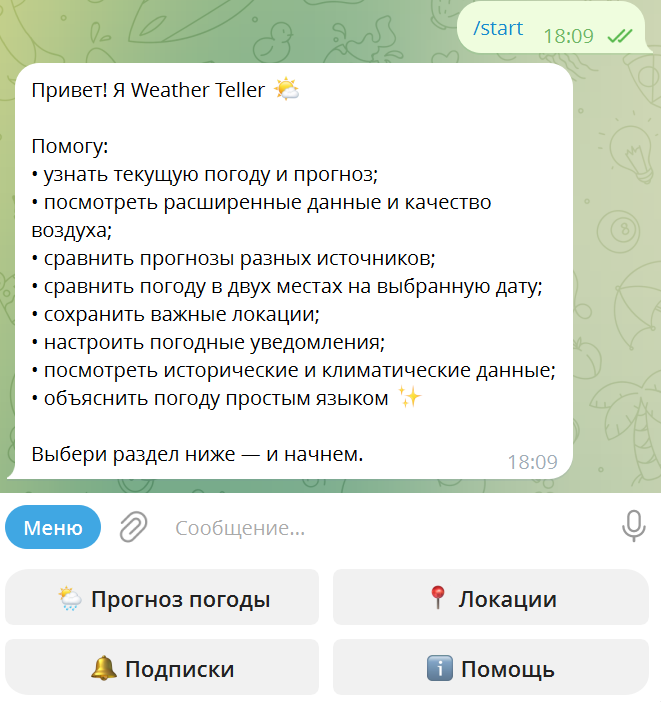
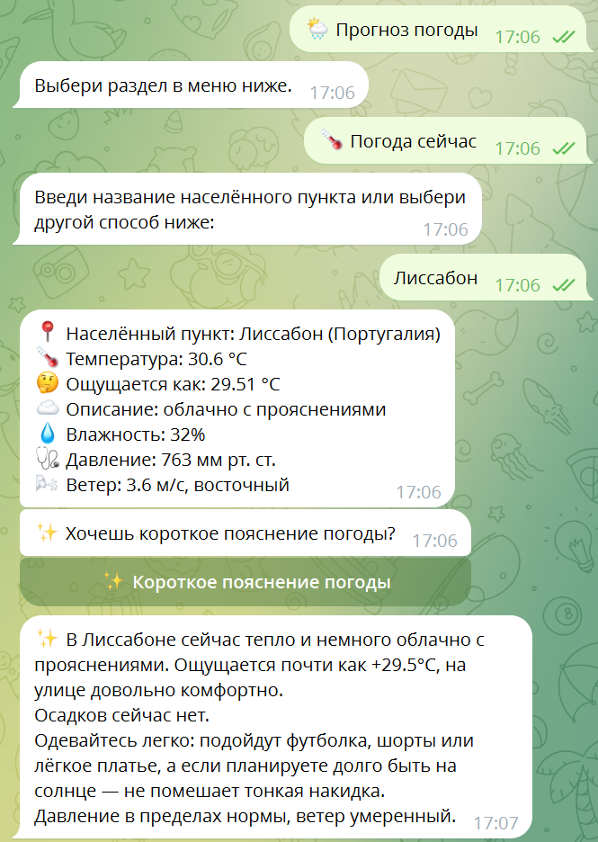
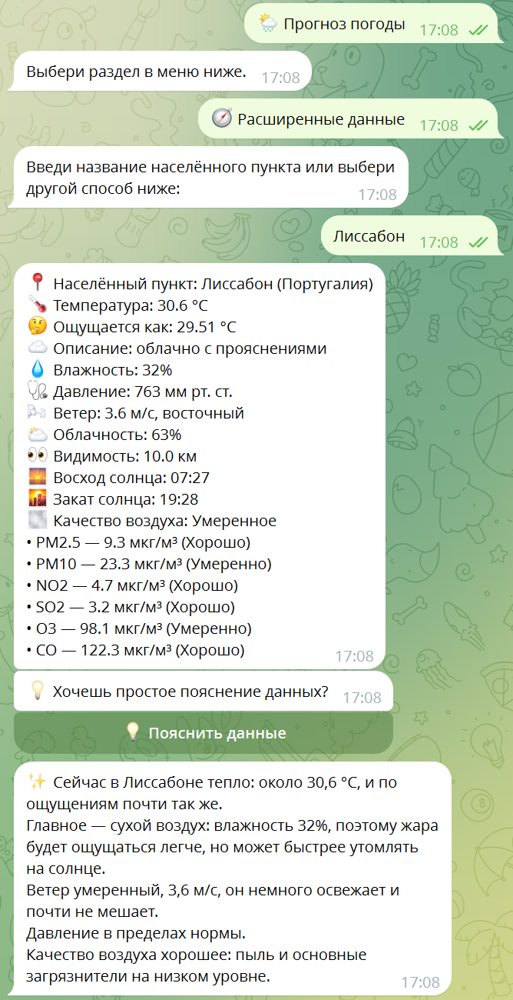
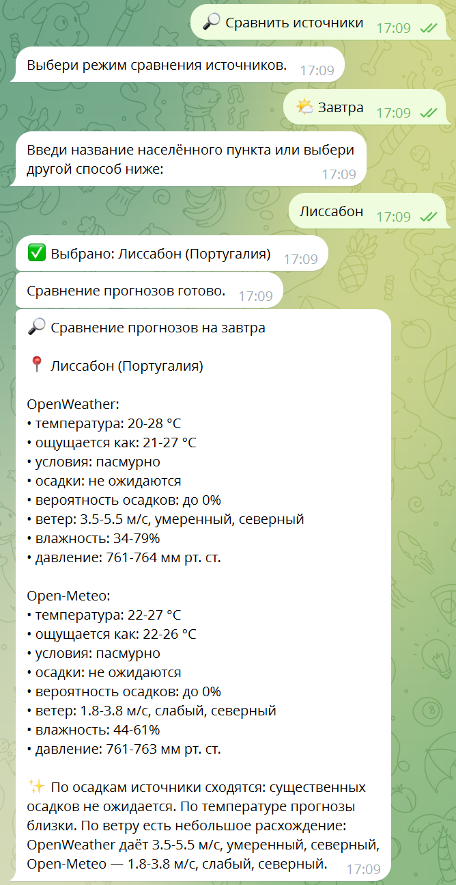
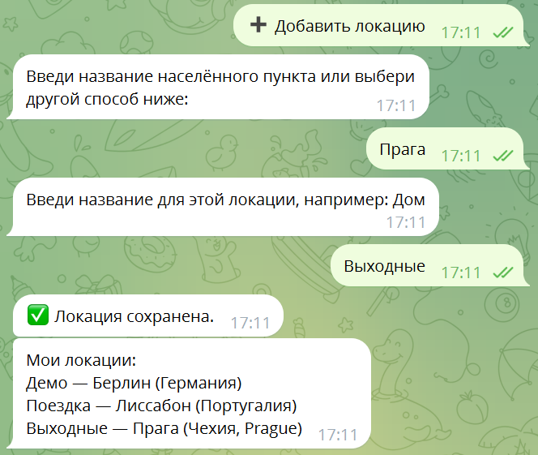
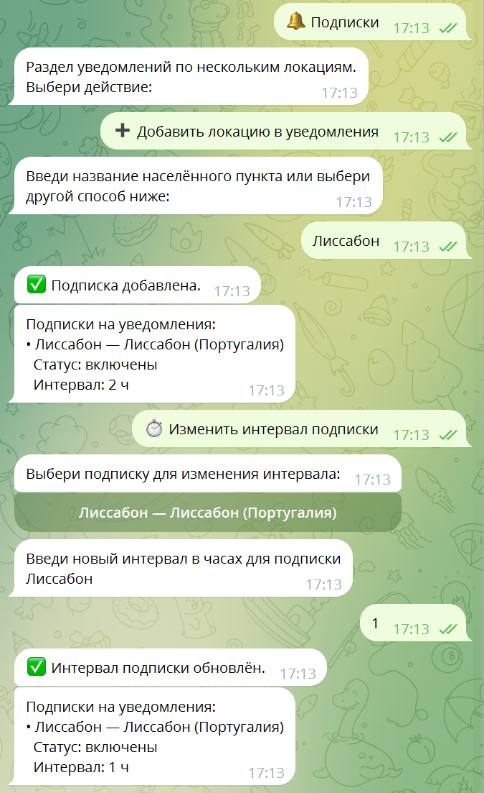
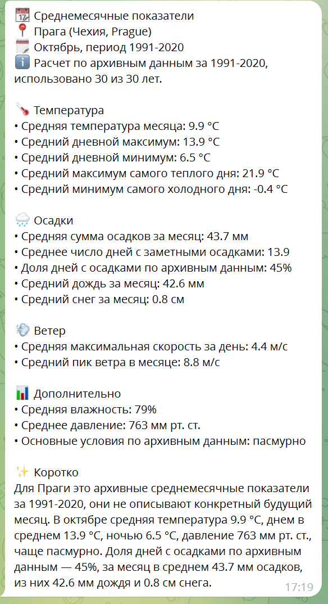
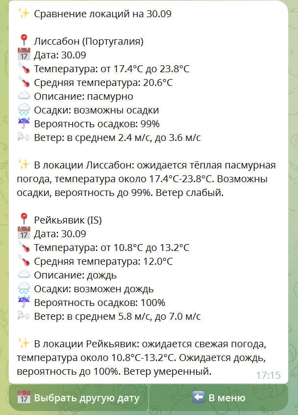

# Weather Teller Telegram Bot

## English Summary

Weather Teller is a Telegram bot for current weather, today and tomorrow forecasts, 5-day forecast, extended weather details, saved locations, location comparison, subscription updates, source comparison, historical weather reference, monthly climate indicators, and short AI explanations. The project combines OpenWeather, Open-Meteo, Open-Meteo Historical Weather API, OpenAI, PostgreSQL, and Docker Compose. It can be run locally with Python for development or through Docker Compose for a closer-to-real deployment flow.

## О проекте

Weather Teller Telegram Bot помогает быстро посмотреть текущую погоду, прогнозы, сравнение локаций, сверку данных из разных погодных источников, архивную справку по погоде и подписки на обновления.

Текущий статус: active beta testing.

Бот ориентирован на понятные ответы в Telegram, аккуратные AI-пояснения и fallback-режимы, когда AI недоступен. Архивная погода показывается как справка по архивным данным, а не как гарантированное наблюдение конкретной метеостанции.

## Скриншоты

Интерфейс бота в Telegram на демонстрационных локациях. Клик по изображению открывает полноразмерный скриншот.

<table>
  <tr>
    <td valign="top" width="50%">
      <b>Главное меню</b><br>
      Основные разделы: прогноз, локации, подписки, помощь.<br><br>
      <a href="screenshots/01_main_menu.png"></a>
    </td>
    <td valign="top" width="50%">
      <b>Текущая погода и AI-пояснение</b><br>
      Основные показатели и короткое пояснение простым языком.<br><br>
      <a href="screenshots/02_current_weather_ai.png"></a>
    </td>
  </tr>
  <tr>
    <td valign="top" width="50%">
      <b>Расширенные данные и качество воздуха</b><br>
      Облачность, видимость, восход и закат, показатели качества воздуха (PM2.5, PM10, NO2, SO2, O3, CO).<br><br>
      <a href="screenshots/03_extended_weather.png"></a>
    </td>
    <td valign="top" width="50%">
      <b>Сравнение прогнозов OpenWeather и Open-Meteo</b><br>
      Данные двух источников рядом и нейтральный вывод о том, где они сходятся и где расходятся.<br><br>
      <a href="screenshots/04_source_comparison.png"></a>
    </td>
  </tr>
  <tr>
    <td valign="top" width="50%">
      <b>Сохраненные локации</b><br>
      Добавление места по названию с собственным именем, например «Поездка».<br><br>
      <a href="screenshots/05_saved_locations.png"></a>
    </td>
    <td valign="top" width="50%">
      <b>Погодные уведомления</b><br>
      Подписка на локации и настройка интервала обновлений.<br><br>
      <a href="screenshots/06_weather_alerts.png"></a>
    </td>
  </tr>
  <tr>
    <td valign="top" width="50%">
      <b>Исторические и климатические данные</b><br>
      Среднемесячные показатели по архивным данным за 1991-2020: справка, а не прогноз.<br><br>
      <a href="screenshots/07_climate_history.png"></a>
    </td>
    <td valign="top" width="50%">
      <b>Сравнение погоды в двух местах на выбранную дату</b><br>
      Помогает сопоставить условия в двух местах на дату поездки: температуру, осадки и ветер, с кратким пояснением по каждой локации.<br><br>
      <a href="screenshots/08_location_comparison.png"></a>
    </td>
  </tr>
</table>

## Возможности

### Главное меню

- `🌦 Прогноз погоды`
- `📍 Локации`
- `🔔 Подписки`
- `ℹ️ Помощь`

### Прогноз погоды

В погодном меню доступны:

- `🌡 Погода сейчас`
- `☀️ Прогноз на сегодня`
- `🌤 Прогноз на завтра`
- `📅 Прогноз на 5 дней`
- `🧭 Расширенные данные`
- `📅 История погоды`
- `🔎 Сравнить источники`

Для текущей погоды, прогнозов и расширенных данных бот умеет показывать короткие AI-пояснения и factual fallback-пояснения, если OpenAI не настроен или временно недоступен.

### Архивная погода

Архивная справка и климатические показатели строятся через Open-Meteo Historical Weather API.

Поддерживается:

- выбор локации текстом;
- выбор через геолокацию;
- выбор сохраненной локации;
- ввод координат;
- быстрые даты: `Вчера`, `7 дней назад`, `30 дней назад`;
- ручной ввод даты в форматах `YYYY-MM-DD`, `YYYY/MM/DD`, `YYYY.MM.DD`, `DD.MM.YYYY`, `DD/MM/YYYY`, `DD-MM-YYYY`, `5 июня 2026`, `5 июн 2026`;
- beta-фича `📊 Средние климатические показатели`.

Внутри beta-фичи доступны два режима:

- `🗓 Месяц конкретного года` — архивная справка за выбранный месяц выбранного года;
- `📆 Среднемесячные показатели` — климатическая справка по архивным данным за период `1991-2020`.

Отчет включает:

- температуру;
- осадки;
- ветер;
- влажность;
- давление;
- погодные условия;
- короткий блок `✨ Коротко` с AI-расшифровкой или fallback-описанием.

Важно:

- это архивная и климатическая справка, а не прогноз;
- для режима `1991-2020` бот явно показывает, что это не прогноз на конкретный месяц;
- в месячных справках используется формулировка `доля дней с осадками по архивным данным`, а не `вероятность осадков`.

History flow в beta-версии уже приведен к общему UX проекта: после выбора локации или даты inline-меню убирается, в чате остается короткое подтверждение выбора, затем приходит результат.

### Сверка источников

Сценарий `🔎 Сравнить источники` показывает данные OpenWeather и Open-Meteo рядом, чтобы можно было посмотреть различия без выбора "лучшего" провайдера.

В коде доступны режимы:

- `🌡 Сейчас`
- `☀️ Сегодня`
- `🌤 Завтра`
- `📅 На дату`

Сверка источников оформляется нейтрально и не подменяет собой обычный прогноз.

### Локации

Раздел локаций поддерживает:

- сохраненные локации;
- добавление по названию города;
- добавление по координатам;
- добавление по геолокации;
- переименование;
- удаление;
- защиту от дублей.

### Сравнение локаций

Бот умеет:

- сравнивать текущую погоду в двух локациях;
- сравнивать прогноз по двум локациям на дату;
- формировать нейтральный вывод без "лучше" и "хуже".

### Подписки

Раздел подписок поддерживает:

- погодные обновления по выбранным или сохраненным локациям;
- интервалы обновлений;
- включение;
- выключение;
- удаление подписок.

## Команды

Фактически зарегистрированные команды:

- `/start`
- `/help`
- `/weather`
- `/current`
- `/tomorrow`
- `/forecast`
- `/geo`
- `/details`
- `/compare`
- `/alerts`
- `/subscriptions`
- `/locations`

Важно:

- отдельной команды `/history` в проекте нет;
- архивная погода доступна через меню `🌦 Прогноз погоды` -> `📅 История погоды`;
- сверка источников доступна через меню `🌦 Прогноз погоды` -> `🔎 Сравнить источники`.

## Стек

- Python 3.12
- pyTelegramBotAPI
- Docker Compose
- PostgreSQL
- OpenWeather API
- Open-Meteo API
- Open-Meteo Historical Weather API
- OpenAI API
- pytest
- GitHub Actions (CI)

## Структура проекта

Ниже перечислены основные файлы и модули, которые отражают текущее состояние репозитория:

```text
weather_telegram_bot/
├── bot.py
├── flows.py
├── keyboards.py
├── app_context.py
├── ai_weather_service.py
├── forecast_service.py
├── weather_history_service.py
├── source_compare_service.py
├── alerts_service.py
├── alerts_subscription_service.py
├── locations_service.py
├── session_store.py
├── postgres_storage.py
├── Dockerfile
├── .dockerignore
├── docker-compose.yml
├── docker-compose.postgres.yml
├── requirements.txt
├── requirements-dev.txt
├── .env.example
├── .env.docker.example
├── .github/
│   └── workflows/
│       └── ci.yml
├── ai/
├── formatters/
│   ├── weather.py
│   ├── forecast.py
│   ├── history.py
│   ├── source_compare.py
│   └── ...
├── handlers/
│   ├── history.py
│   ├── callbacks_history.py
│   ├── source_compare.py
│   ├── callbacks_source_compare.py
│   ├── locations.py
│   ├── callbacks_locations.py
│   ├── forecast.py
│   ├── details.py
│   └── ...
├── weather/
│   ├── api.py
│   ├── open_meteo.py
│   ├── air_quality.py
│   ├── descriptions.py
│   ├── locations.py
│   └── pressure.py
├── workers/
│   └── alerts_worker.py
├── utils/
│   ├── date_parsing.py
│   └── logging_setup.py
├── screenshots/
└── tests/
    ├── test_weather_history_service.py
    ├── test_weather_history_formatter.py
    ├── test_weather_history_flow.py
    ├── test_weather_history_handlers.py
    ├── test_source_compare_service.py
    ├── test_source_compare_formatter.py
    ├── test_source_compare_flow.py
    ├── test_menu_keyboards.py
    ├── test_bot_menu_routing.py
    └── ...
```

Хранение данных: пользовательские данные и AI cache лежат в PostgreSQL (`postgres_storage.py`), временные состояния диалогов — в памяти процесса (`session_store.py`).

## Переменные окружения

Актуальный набор переменных — в `.env.example` (запуск через Python) и `.env.docker.example` (Docker Compose). Значения ниже — плейсхолдеры из `.env.example`:

```env
OW_API_KEY=your_openweather_key
BOT_TOKEN=your_telegram_token
OPEN_METEO_FALLBACK=1

PGHOST=localhost
PGPORT=5432
PGDATABASE=weather_teller
PGUSER=weather_user
PGPASSWORD=change_me_strong_password

OPENAI_API_KEY=your_openai_api_key
OPENAI_MODEL=gpt-5.4-mini
```

Пояснения:

- `OW_API_KEY` обязателен для сценариев OpenWeather.
- `BOT_TOKEN` обязателен для запуска Telegram-бота.
- `OPEN_METEO_FALLBACK=1` включает fallback на Open-Meteo для current weather, forecast и geocoding, когда это предусмотрено кодом.
- Open-Meteo в этом проекте используется без отдельного API key.
- `PGHOST`, `PGPORT`, `PGDATABASE`, `PGUSER`, `PGPASSWORD` — параметры подключения к PostgreSQL. В Docker Compose `PGHOST=postgres` (имя сервиса), при запуске через Python — адрес вашего PostgreSQL.
- `OPENAI_API_KEY` опционален. Если он не задан, бот продолжает работать через factual fallback-пояснения.
- `OPENAI_MODEL` задает модель для коротких AI-пояснений; значение по умолчанию в коде — `gpt-5.4-mini`.

Реальные значения хранятся только в локальном `.env`: он указан в `.gitignore` и исключен из Docker build context (`.dockerignore`).

## Локальный запуск

### Рекомендуемый путь: Docker Compose

Создайте `.env` из шаблона для Docker и заполните значения (`BOT_TOKEN`, `OW_API_KEY`, `PGPASSWORD` и т. д.):

```bash
cp .env.docker.example .env
```

Затем:

```bash
docker compose up -d --build
docker compose ps
docker compose logs -f weather_bot
docker compose down
```

`docker-compose.yml` читает `.env` дважды: для подстановки `${PGDATABASE}`, `${PGUSER}`, `${PGPASSWORD}` в сервис `postgres` и через `env_file` для контейнера `weather_bot`.

### Запуск только бота после сборки

```bash
docker compose up -d --build weather_bot
docker compose logs -f weather_bot
```

### Запуск через Python для разработки

Если нужен быстрый локальный цикл без контейнеров:

```bash
python -m venv venv
venv\Scripts\activate          # Linux/macOS: source venv/bin/activate
pip install -r requirements-dev.txt   # для запуска одного бота достаточно requirements.txt
python bot.py
```

Перед запуском заполните `.env` на основе `.env.example`. PostgreSQL должен быть доступен по `PGHOST`/`PGPORT`: в compose-файлах порт PostgreSQL наружу не публикуется (строка `ports` закомментирована).

Важно: если используется тот же `BOT_TOKEN`, нельзя одновременно держать production polling и локальный polling. Иначе Telegram может вернуть conflict между двумя процессами.

## Docker Compose

В проекте есть два compose-файла:

- `docker-compose.yml` — основной локальный сценарий с сервисами `postgres` и `weather_bot`;
- `docker-compose.postgres.yml` — отдельный сценарий только для PostgreSQL.

Полезные команды:

```bash
docker compose ps
docker compose logs -f weather_bot
docker compose up -d --build
docker compose up -d --build weather_bot
docker compose down
```

### Docker-образ

- Образ основан на `python:3.12-slim`; ставятся только production-зависимости из `requirements.txt` (`requirements-dev.txt` и pytest в образ не устанавливаются).
- Бот запускается не от root, а от пользователя `appuser` (UID 10001). `/app` принадлежит этому пользователю, поэтому `bot.log` и его ротируемые копии создаются без привилегий.
- `.dockerignore` исключает из build context `.env`, `.env.*`, `.git`, `venv`, логи и кэши: секреты не попадают в образ и передаются только при запуске через `env_file: .env`.
- Чтобы пересобрать образ на актуальном базовом образе `python:3.12-slim`: `docker compose build --pull`.

### Логирование

Логи пишутся в stderr (виден в `docker compose logs`) и в `bot.log` с ротацией (до 5 МБ на файл, 3 архивные копии). Значение `BOT_TOKEN` маскируется в записях лога приложения и логгера pyTelegramBotAPI, включая traceback сетевых ошибок, в которых токен присутствует в URL (`/bot<TOKEN>/getUpdates`): вместо него выводится `[REDACTED:BOT_TOKEN]`.

## PostgreSQL

PostgreSQL используется для хранения пользовательских данных и AI cache.

Актуальные таблицы:

- `users`
- `saved_locations`
- `alert_subscriptions`
- `ai_response_cache`

На текущем этапе для history flow и source compare не добавлялись отдельные таблицы. Архивная погода и сверка источников работают через сервисы и существующую инфраструктуру приложения.

## Тесты и проверки

Установка и запуск с нуля (нужен Python 3.12):

```bash
pip install -r requirements-dev.txt
python -m pytest -q
python -m compileall -q . -x "venv|\.git"
python -m pip check
git diff --check
```

Тесты не требуют `.env`, секретов, PostgreSQL и доступа к сети: Telegram, OpenWeather, Open-Meteo и OpenAI подменяются, хранилище проверяется через моки и in-memory SQLite. Ожидаемый результат: без падений; часть тестов помечена `skip`/`xfail` (заглушки интеграционных тестов PostgreSQL).

Дополнительно, при наличии `ripgrep`: `rg "ё|Ё"` (проверка на букву `ё`; в комментариях и docstrings старого кода совпадения пока есть).

CI: GitHub Actions (`.github/workflows/ci.yml`) на каждый push и pull request в `main` ставит `requirements-dev.txt` на Python 3.12 и выполняет `pip check`, `compileall`, проверку пробелов в изменениях (`git diff --check`) и `pytest`.

### Зависимости

- `requirements.txt` — production-зависимости; прямые зависимости закреплены точными версиями (`==`).
- `requirements-dev.txt` — `requirements.txt` плюс pytest.
- Транзитивные зависимости pip подбирает при установке (lock-файла нет). Обновление версий — осознанное изменение: поменять пин, прогнать тесты и `pip check`.

Что уже покрыто тестами:

- меню и routing;
- weather history service;
- weather history formatter;
- weather history flow;
- weather history handlers;
- source compare service;
- source compare formatter;
- source compare flow;
- date parsing;
- error paths для history и fallback-сценариев Open-Meteo;
- фоновая проверка подписок и сохранение ее состояния;
- маскирование секретов в логах и ротация `bot.log`;
- статические проверки Docker build context и non-root запуска.

## Roadmap

### Near-term

- beta wording polish и cleanup пользовательских текстов;
- дополнительная полировка history UX там, где это нужно после smoke-test;
- сценарий "выбрать другую дату" для той же history-локации без повторного ввода;
- voice input как отдельный следующий этап, без смешивания с текущими weather flows.

### Later

- TTS и голосовой вывод;
- более широкий климатический контекст там, где это действительно полезно;
- дополнительные погодные провайдеры;
- наблюдаемость, логи и monitoring для beta-эксплуатации.

## Примечания

- OpenWeather и Open-Meteo могут отличаться по расчетным моделям и таймзонам, поэтому сверка источников показывает данные рядом, а не пытается выбрать "правильный" ответ.
- Архивная погода описывает примерную картину дня по архивным данным Open-Meteo.
- AI-пояснения короткие и необязательные: при недоступности OpenAI бот должен оставаться полезным и без них.
